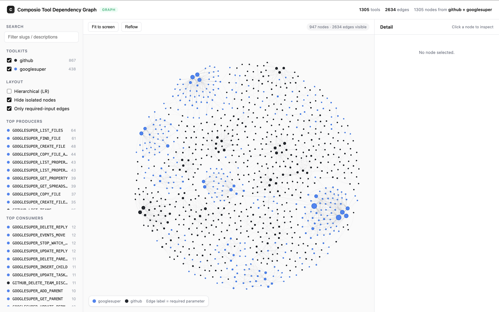
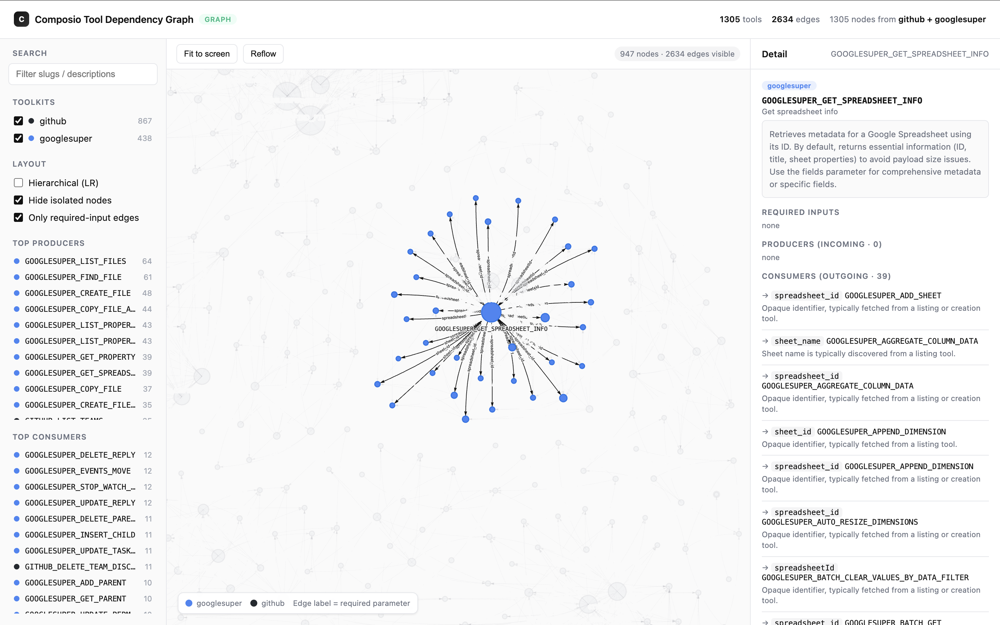
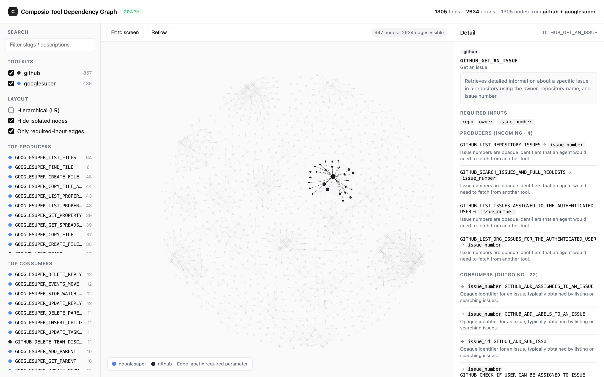
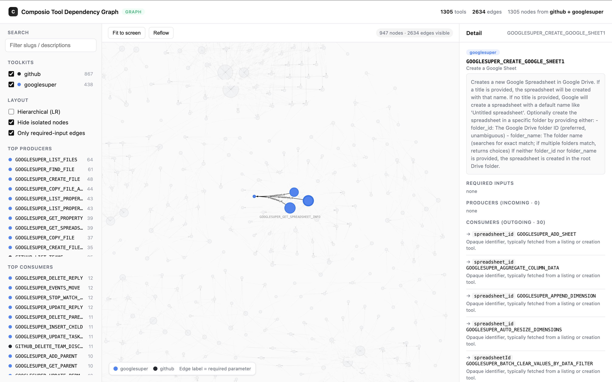

# composio-tool-graph

> AI agents fail when they call a tool before fetching its prerequisites. This maps every dependency between Composio tools — so agents always know what to act on first.

An interactive dependency graph across Composio's **Google Super** and **GitHub** toolkits (1305 tools, 2634 dependency edges). An edge `A → B` labeled with a parameter means tool `A` produces a value (e.g. `thread_id`, `message_id`, `file_id`) that tool `B` requires as input — the missing layer that lets an agent chain actions in the right order.

## screenshots

**Full graph** — 1305 tools across GitHub and Google Super, 2634 dependency edges.


**A producer's reach** — selecting `GOOGLESUPER_GET_SPREADSHEET_INFO` reveals every tool that consumes a `spreadsheet_id` it can supply.


**Per-tool inspection** — `GITHUB_GET_AN_ISSUE` with its producers (where `issue_number` comes from) and consumers in the detail panel.


**Focused cluster** — `GOOGLESUPER_CREATE_GOOGLE_SHEET` and the chain of tools that build on its output.


## how it works

A three-stage pipeline:

1. `src/fetch-tools.ts` — pulls the raw tool catalogs from Composio into `data/`.
2. `src/analyze.ts` — LLM-assisted analysis (via OpenRouter) deciding, for each required input, whether the user supplies it or another tool must produce it → `data/graph.json`.
3. `src/visualize.ts` — renders `data/graph.json` into a self-contained interactive `graph.html` (vis-network).

```bash
bun run src/fetch-tools.ts   # re-fetch tool catalogs from Composio
bun run src/analyze.ts       # LLM dependency analysis → data/graph.json
bun run src/visualize.ts     # rebuild graph.html, then open it
```

---

## task brief

we care about the quality and structure of the dependency relationships you discover

some actions need precursor actions before being able to execute them

a concrete example

1. the tool `GMAIL_REPLY_TO_THREAD` which needs a `thread_id`
2. which can be got by `GMAIL_LIST_THREADS` as an example, there could be other ways to get a `thread_id` too

a second more dense exmaple
the send email tool needs an email, if you give a name it should fetch the name from contacts and then you can send the email


when we agentically execute actions inside composio, we need to know either what info to get from the user or what other action we should take before we execute the action.

you are supposed to build a dependency graph for this

to keep this limited in scope, we expect you to only do it for [Google Super](https://docs.composio.dev/toolkits/googlesuper) and [Github](https://docs.composio.dev/toolkits/github)

the final submission should be a visualized dependency graph where i can see connection (this is not super important just should exist for me to see if graph with edges and nodes)

## get started

1. go to https://platform.composio.dev and get an api key
2. run `COMPOSIO_API_KEY=PUT_YOUR_KEY_HERE sh scaffold.sh` will give you an **openrouter-key**
3. check `src/index.ts` to see how to fetch full google raw tools (fastest way to run is https://bun.sh/)

you can implement this with whatever language you want, feel free to use language models and coding tools

## submit

once you are done use `sh upload.sh <your_email> [--skip-session]`

## agent session tracing (required by default)

- `upload.sh` collects recent local agent sessions into `agent-sessions/` before creating your submission zip.
- It includes recent activity from this task folder for Codex, Claude Code, OpenCode, and Cursor (90-minute window).
- If no recent sessions are found, interactive runs prompt you before continuing.
- Use `--skip-session` only if you explicitly want to upload without session tracing.

examples:

- `sh upload.sh your_email@example.com`
- `sh upload.sh your_email@example.com --skip-session`

NOTE:  Feel free to use LLM, you will be judged by the quality of output, eval...
